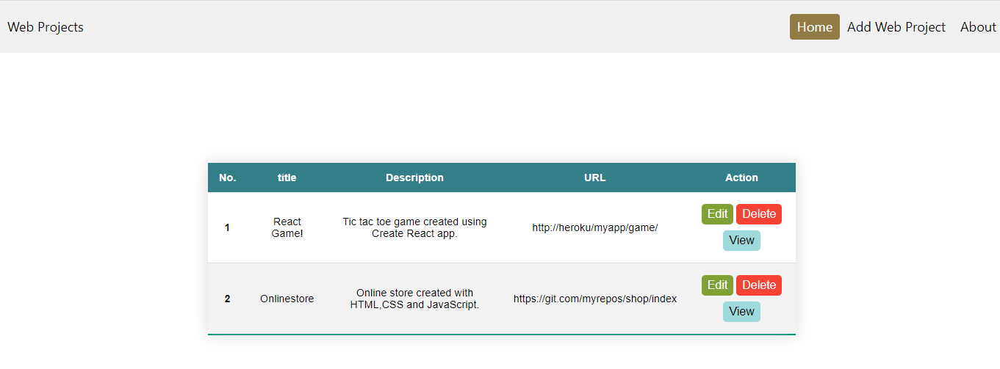
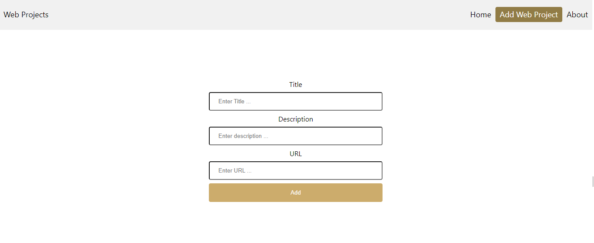

# Web-Project App with React & Express

> This is a Full-stack app using React and Express. It demonstrates how the back-end Express app and the front-end React app work together.

## Table of Contents:

- [General Info](#general-information)
- [Installation](#installation)
- [Usage Instructions](#usage-instructions)
- [Credits](#credits)
- [Contact](#contact)

## General Information

This is a basic web application which demonstrates how the back-end Express app and the front-end React app work together. I created a Restful API using Express which will allow users to store a list of "Web Project" items. The React frontend will retrieve the list of web projects from the backend and this will be available for end-users to view. Furthermore, these users will be able to use the frontend in order to add, edit and delete web projects from the list (CRUD operations).

## Installation

To run this project, do the following:

1. cd backend
2. npm install
3. npm start
4. Open a new terminal
5. cd backend\frontend
6. npm install
7. npm start
8. The frontend will automatically open the application in the browser. The backend/server runs on http://localhost:8080/ and the frontend on http://localhost:3000

## Usage Instructions

As stated above, this is a simple web application to use. The homepage (http://localhost:3000) will display all the web projects which were retrieved from the backend. The details of the web project will be displayed in a table under the following headings:

| No. | Title | Description | URL | Action |
| --- | ----- | ----------- | --- | ------ |

Below the Action heading, there will be three buttons which will allow users to edit, delete or view more details about a specific web project.

Should users wish to "Add" a new web project to the list, they can simply navigate to the "Add Web Project" tab and fill out the form accordingly.

## Credits

- The React + Node js + Express js - CRUD Operations  [tutorial](https://www.youtube.com/watch?v=qrxTyDDfp0I&t=3094s) - by CodeWithVishal.
- HyperionDev - https://www.hyperiondev.com/

## Contact

👤 **Riaz Karolia**

Feel free to contact me on [LinkedIn](https://www.linkedin.com/in/riaz-karolia/)

